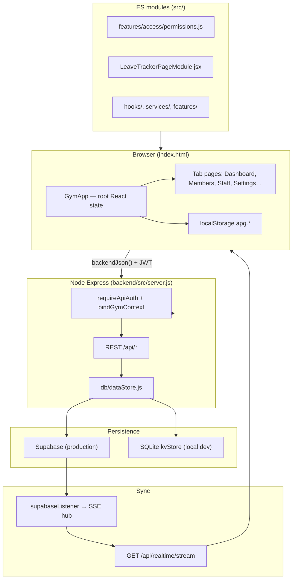
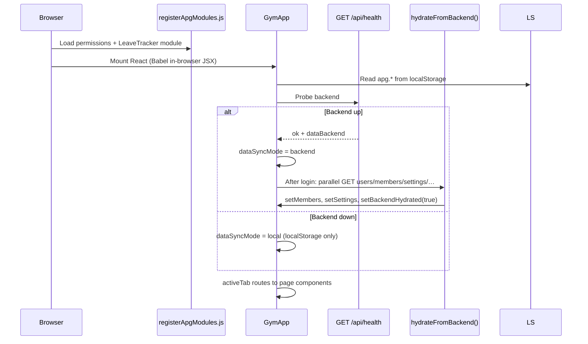
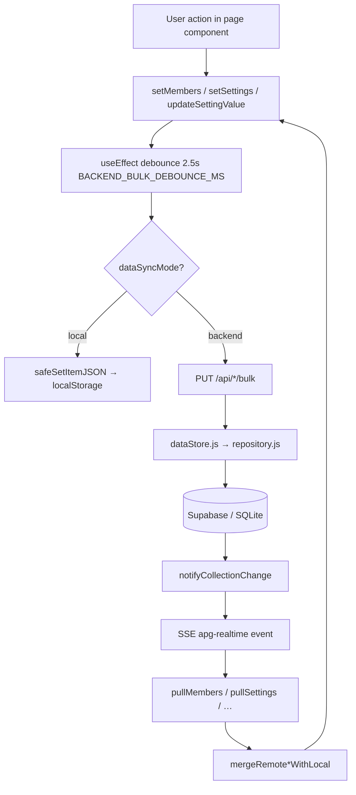
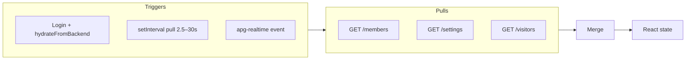
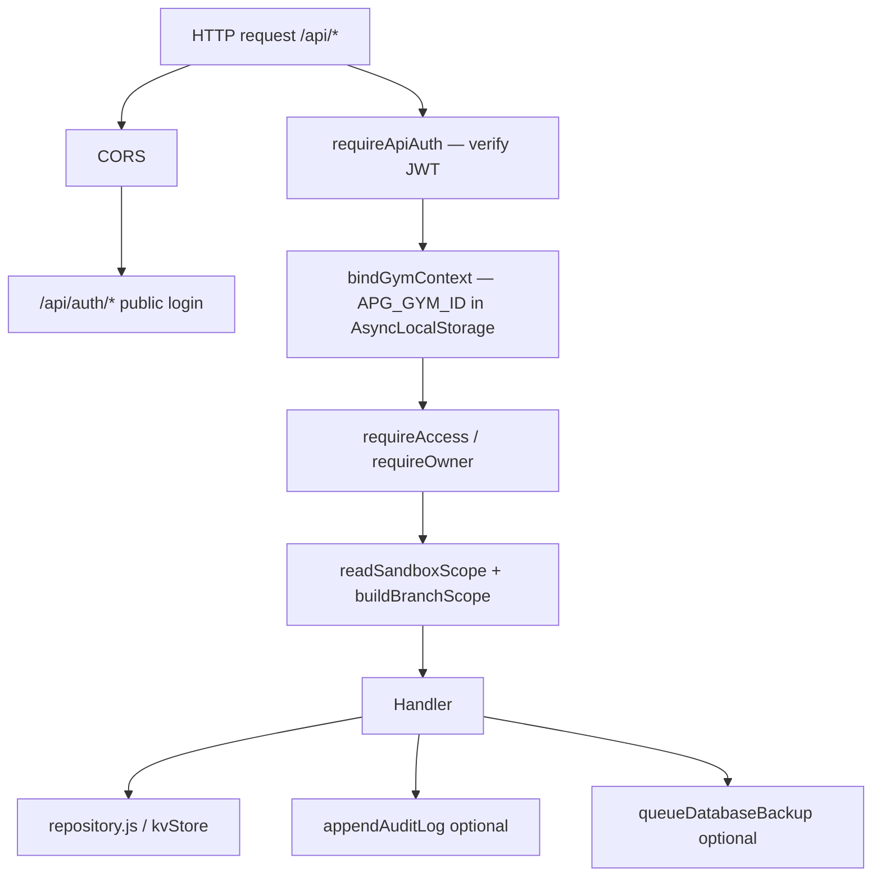

# Action Plus Gym Management App — Architecture Reference

This document describes how the application is structured, how data flows, and where to change code when adding or modifying features. Keep it updated when you add routes, tabs, or persistence behavior.

**Last updated:** May 2026  
**Primary codebase:** `index.html` (React monolith) + `backend/src/` (Express API) + `src/` (shared ES modules)

---

## Table of contents

1. [High-level system map](#1-high-level-system-map)
2. [App bootstrap and navigation](#2-app-bootstrap-and-navigation)
3. [Authentication and RBAC](#3-authentication-and-rbac)
4. [Data model (collections)](#4-data-model-collections)
5. [Write path (saves to database)](#5-write-path-saves-to-database)
6. [Read path (load and refresh)](#6-read-path-load-and-refresh)
7. [Feature flows](#7-feature-flows)
8. [Backend request pipeline](#8-backend-request-pipeline)
9. [Testing layout](#9-testing-layout)
10. [Where to change what](#10-where-to-change-what)
11. [Dual-mode operation](#11-dual-mode-operation)
12. [Key file index](#12-key-file-index)

---

## 1. High-level system map



| Layer | Main files |
|--------|------------|
| UI | `index.html`, `styles.css` |
| Shared logic | `src/features/access/permissions.js`, `src/services/apiClient.js`, `src/features/members/*` |
| API | `backend/src/server.js`, `backend/src/routes/auth.js`, `backend/src/routes/gymCodes.js` |
| Data | `backend/src/db/dataStore.js`, `backend/src/db/supabase/repository.js` |
| Future UI | `v2/` (Visitors strangler — separate Vite app) |

---

## 2. App bootstrap and navigation



### Tab routing (inside `GymApp`)

| Tab | Component | Primary state |
|-----|-------------|---------------|
| Dashboard | `DashboardSummary` + `DashboardView` | `members`, `filters` |
| Members | `DashboardView` / member rows | `members`, `visitors` |
| PT Clients | `PTClientsPage` | `members`, `settings.ptClientProfiles` |
| WhatsApp SMS | `WhatsAppSmsPage` | `members`, `smsEvents`, `settings.smsTemplates` |
| Finance | `FinancePage` | `financeTransactions`, `members` |
| Staff | `UserManagementPage` | `users`, `settings.roleTemplates` |
| Attendance | `AttendancePage` | `settings.staffAttendance` |
| Leave Tracker | `LeaveTrackerPageModule` (dynamic) | `settings.leaveRequests` |
| Settings | `SettingsPage` | `settings` |
| Logs | `LogsPage` | `logs` |
| Support | `SupportPage` | template fields in `settings` |
| Backend | `BackendPage` | process control (owner) |

**Entry points**

- Frontend: open `index.html` (served on port 5500/5501 via `npm run dev:all`)
- Backend: `backend/src/server.js` (port 4000/4001)
- Module loader: `src/runtime/registerApgModules.js`

---

## 3. Authentication and RBAC

```mermaid
flowchart LR
  Login["LoginPage"] --> AuthAPI["POST /api/auth/login"]
  AuthAPI --> JWT["JWT: userId, gymId, gymCodeId, role"]
  JWT --> Session["localStorage AUTH_SESSION_KEY"]
  Session --> backendJson["Every API: Authorization Bearer"]

  backendJson --> requireApiAuth["requireApiAuth"]
  requireApiAuth --> bindGym["bindGymContext → APG_GYM_ID scope"]
  bindGym --> requireAccess["requireAccess / requireOwner"]

  requireAccess --> Handler["Route handler"]
```



### Roles and permissions

- **Owner** (`user.id === 'owner'`): full access; bulk users/settings, backups, role templates, payment delete.
- **Staff**: `users[].sections` (tab visibility) + `users[].access` (fine-grained flags).
- Definitions: `src/features/access/permissions.js` (loaded into `window.__APG_MODULES` and mirrored via `normalizeAccess()` in `index.html`).
- Backend enforcement: `backend/src/middleware/permissions.js`, `backend/src/auth/accessControl.js`.

### Multi-branch (gym codes)

- Tables: `gym_codes`; members/staff have `assignedGymCodeId`.
- Owner sees all branches; staff filtered by `buildBranchScope()` in `server.js`.
- Service: `backend/src/services/gymCodesService.js`, routes: `backend/src/routes/gymCodes.js`.

---

## 4. Data model (collections)

```mermaid
erDiagram
  GYM ||--o{ MEMBERS : has
  GYM ||--o{ STAFF_USERS : has
  GYM ||--o{ SETTINGS_LOOKUP : has
  GYM ||--o{ ROLE_TEMPLATES : has
  MEMBERS ||--o{ PAYMENT_HISTORY : has
  MEMBERS ||--o{ MESSAGE_HISTORY : has
  MEMBERS ||--o{ ATTACHMENTS : has

  GYM {
    string id APG_GYM_ID
  }
  MEMBERS {
    string member_code
    string assigned_gym_code_id
    json paymentHistory
  }
  SETTINGS_LOOKUP {
    string category plans_statuses_etc
    string value
  }
```

| Frontend state key | API | Supabase / storage |
|--------------------|-----|---------------------|
| `members` | `GET/PUT /api/members` | `members` + child tables |
| `users` | `GET/PUT /api/users` | `staff_users`, sections, access |
| `settings` | `GET/PUT /api/settings` | lookups, templates, config, roles, leave, attendance |
| `visitors` | `GET/PUT /api/visitors` | `visitors` |
| `logs` | `GET/PUT /api/logs` | `audit_logs` |
| `financeTransactions` | `GET/PUT /api/finance` | `finance_transactions` |
| `smsEvents` | `GET/PUT /api/sms-events` | `sms_status_events` |
| `gymCodes` | `GET/POST/DELETE /api/gym-codes` | `gym_codes` |

Member child rows sync via `backend/src/db/supabase/collectionSync.js` (`syncMemberChildRows`) for payments, messages, attachments, injury notes.

---

## 5. Write path (saves to database)



### Bulk vs surgical APIs

| Data | Default sync | Surgical API (preferred for single edits) |
|------|--------------|-------------------------------------------|
| Members | `PUT /api/members/bulk` | `PATCH /api/members/:memberId` |
| Settings lookups | Bulk skipped if lookup-only | `POST/DELETE /api/settings/lookups` |
| Role templates | **Excluded from settings bulk** | `PUT /api/settings/role-templates` |
| Payment delete | — | `DELETE /api/members/:id/payments/:paymentId` |
| WhatsApp template | — | `PATCH /api/whatsapp-templates/:key` |
| Leave | Staff POST | `POST/PATCH /api/leave-requests` |
| Attendance | — | `POST /api/attendance/punch`, `PUT /api/attendance/records` |

### Merge rules (prevent data loss / resurrection)

- **`mergeRemoteMembersWithLocal`** — newer `updatedAt` wins; payment history prefers newer side when sync pending.
- **`mergeSettingsPull`** — lookup lists never wiped by empty remote; role templates deduped by title.
- **`memberSyncPending`** / **`settingsLookupGuardUntilRef`** — block pull from overwriting optimistic local edits.

---

## 6. Read path (load and refresh)



**Realtime:** Supabase postgres changes → `backend/src/realtime/supabaseListener.js` → `broadcastChange` → browser `EventSource` on `/api/realtime/stream` → `window.dispatchEvent('apg-realtime')`.

When SSE is connected, settings polling is reduced to save Supabase quota.

---

## 7. Feature flows

### 7.1 Total Revenue (Monthly) — Dashboard & Finance

```
members[] → buildCollectedRevenueEntries (paymentHistory paidAt only)
financeTransactions[] (income) → buildManualIncomeRevenueEntries (tx date)
→ buildAllFinanceRevenueEntries → sumMonthlyCollectedRevenue(entries, YYYY-MM)
```

**Files:** `src/features/finance/collectedRevenue.js`, `monthlyRevenue.js`, `financeLedger.js`, `financeMonthScope.js`; wired from `index.html` via `registerApgModules.js`.  
**Finance ledger:** paid rows from `paymentHistory` (transaction date); pending rows from overdue billing; manual rows from `finance_transactions`.  
**Trend chart:** four months ending at the selected `financeMonth` (`lastFourMonthTrendSlots`).  
**Backfill:** `backend/scripts/backfill-member-payment-history.js` for empty `paymentHistory` from `paymentReceivedAt` / `billingDate`.

**Plan analytics:** `src/features/analytics/planDistribution.js` — Dashboard and Finance Plan Popularity share `buildMembershipPlanDistribution` (member counts, plan name normalization).

**Payment History filter:** `src/features/members/paymentHistoryFilters.js` — month filter on `paidAt` (revenue month).

### 7.2 Members — add, edit, payments

```mermaid
flowchart TD
  Add["Add Member wizard"] --> setMembers
  Edit["Edit modal"] --> setMembers
  Pay["Add payment entry"] --> paymentHistory
  Pay --> BulkOrPatch["members bulk or PATCH"]
  DelPay["Delete payment"] --> DELETE payments API
  DelPay --> computePaymentDeletePatch
```

Payment ID logic: `backend/src/db/supabase/paymentIds.js` + frontend `stablePaymentHistoryRowId`.

### 7.3 Settings — Master Data tiles

```
SettingsPage.handleAdd / removeOpt
→ POST/DELETE /api/settings/lookups
→ updateSetting (local)
→ settings bulk SKIPPED for lookup-only changes
```

Anti-wipe: `backend/src/db/supabase/settingsLookupLogic.js` + `mergeSettingsPull`.

### 7.4 Staff — Role Configuration Manager

```
UserManagementPage.saveRoleTemplate / deleteRoleTemplate
→ PUT /api/settings/role-templates
→ dedupeRoleTemplates + external_template_id upsert (staff_role_templates)
```

**Do not** sync roles via `PUT /api/settings/bulk` (excluded in frontend `settingsForBulkSync`).

### 7.5 WhatsApp SMS

```
WhatsAppSmsPage → settings.smsTemplates
→ open WhatsApp link → log smsEvents + member.messageHistory
→ bulk sync sms-events + members
```

### 7.6 Finance

```
FinancePage → financeTransactions[]
→ PUT /api/finance/bulk
```

Dashboard revenue tile uses **members**, not `financeTransactions`.

---

## 8. Backend request pipeline



### Main API routes (grouped)

| Domain | Routes |
|--------|--------|
| Health | `GET /api/health` |
| Auth | `POST /api/auth/login`, password reset, etc. (`routes/auth.js`) |
| Realtime | `GET /api/realtime/stream` |
| Members | `GET/PUT bulk`, `PATCH :id`, `DELETE :id/payments/:paymentId` |
| Visitors | `GET/PUT bulk` |
| Users | `GET/PUT bulk`, `POST cleanup` (owner) |
| Settings | `GET`, `PUT bulk`, `PUT role-templates`, `POST/DELETE lookups` |
| WhatsApp templates | `GET`, `PATCH :key` |
| Leave | `POST`, `PATCH :id`, `POST cleanup` |
| Attendance | `POST punch`, `PUT records`, `POST cleanup` |
| Logs | `GET`, `PUT bulk`, `POST cleanup` |
| Finance | `GET`, `PUT bulk` |
| SMS events | `GET`, `PUT bulk` |
| Gym codes | CRUD (`routes/gymCodes.js`) |
| Backups | `GET`, restore, prune (owner) |

---

## 9. Testing layout

| Type | Location | Command |
|------|----------|---------|
| Unit | `backend/src/**/*.test.js`, `tests/*.test.js` | `npm test` |
| E2E | `tests/e2e/critical/*.spec.ts` | `npm run test:e2e:critical` |
| API helpers | `tests/e2e/utils/api-client.ts` | Used by Playwright |

Tag critical specs with `@critical` in describe block.

---

## 10. Where to change what

| Goal | Start here |
|------|------------|
| Add sidebar tab | `src/features/access/permissions.js` → `GymApp` tab list → new `*Page` → `activeTab ===` block in `index.html` |
| Add permission flag | `permissions.js` + `normalizeAccess` in `index.html` + `backend/src/auth/accessControl.js` |
| Add API endpoint | `backend/src/server.js` + `repository.js` + `dataStore.js` |
| Add DB table | `backend/migrations/` + `backend/src/db/tables.js` + `mappers.js` |
| Change member save | `membersWrite.js`, `repository.js`; frontend bulk effect ~3890 in `index.html` |
| Change settings master data | `SettingsPage`, `settingsLookupLogic.js`, lookup APIs |
| Change payment delete | `confirmDeleteMemberPaymentEntry`, `deleteMemberPayment` in `repository.js` |
| Change dashboard KPIs | `DashboardSummary` useMemo blocks |
| Change sync / polling | Pull `useEffect`s ~3937–4085 in `index.html` |
| Add E2E test | `tests/e2e/critical/` + `api-client.ts` |

---

## 11. Dual-mode operation

Every feature should support two modes:

1. **`dataSyncMode === 'backend'`** — JWT + API + Supabase/SQLite; debounced bulk; SSE pull.
2. **`dataSyncMode === 'local'`** — `localStorage` only; no API writes.

Pattern:

```javascript
if (dataSyncMode === 'backend' && !backendHydrated) return;
if (dataSyncMode !== 'backend') {
  safeSetItemJSON(STORAGE_KEYS.members, members);
  return;
}
// debounced backendJson('/members/bulk', …)
```

Use **surgical APIs** for owner-critical single-row writes (lookups, role templates, payment delete).

---

## 12. Key file index

```
Action Plus Gym Management App/
├── index.html                 # Main React app (GymApp, all pages, sync logic)
├── styles.css
├── src/
│   ├── runtime/registerApgModules.js
│   ├── features/access/permissions.js
│   ├── features/members/
│   ├── services/apiClient.js
│   └── components/LeaveTrackerPageModule.jsx
├── backend/
│   ├── src/server.js          # Express app + routes
│   ├── src/routes/auth.js
│   ├── src/routes/gymCodes.js
│   ├── src/db/dataStore.js    # Supabase vs SQLite switch
│   ├── src/db/supabase/
│   │   ├── repository.js      # CRUD + settings/members writes
│   │   ├── collectionSync.js  # Child row upsert/delete
│   │   ├── paymentIds.js
│   │   ├── settingsLookupLogic.js
│   │   └── roleTemplateLogic.js
│   ├── src/middleware/        # auth, gym context, permissions
│   └── migrations/            # Supabase SQL
├── tests/e2e/critical/        # Playwright specs
├── docs/
│   ├── ARCHITECTURE.md          # This file
│   └── ARCHITECTURE.pdf         # PDF export
└── v2/                          # Optional Vite strangler (visitors)
```

---

## Regenerating the PDF

From project root:

```bash
npm run docs:architecture-pdf
```

Or open `docs/ARCHITECTURE.html` in a browser and use **Print → Save as PDF**.
