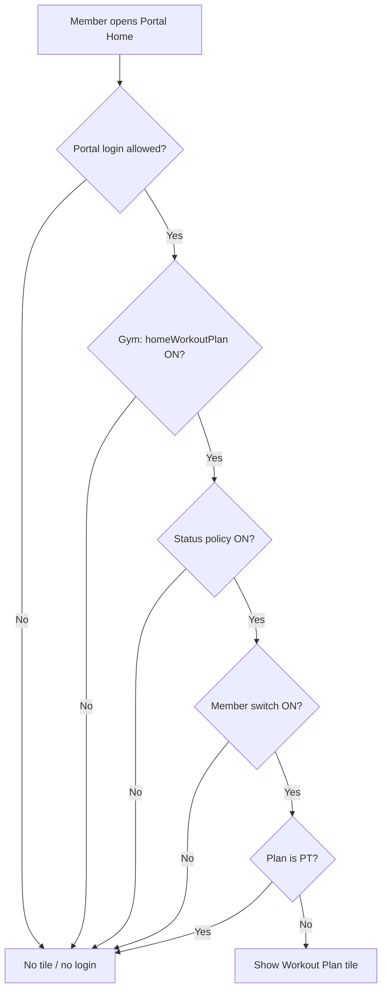
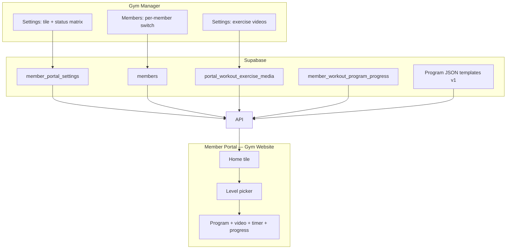
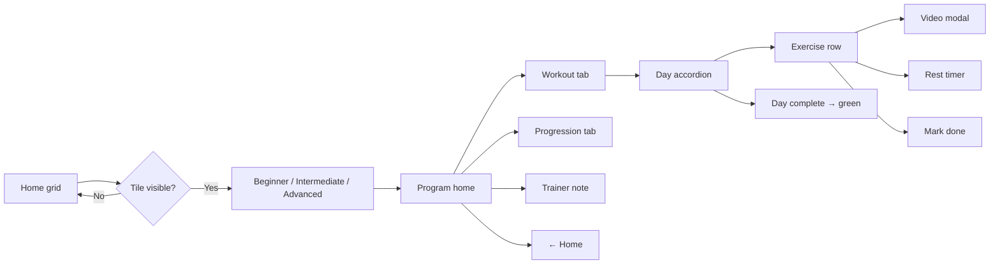

# Member Portal — Workout Plan Specification

**Status:** Planning only — not implemented  
**Last updated:** 2026-08-22  
**Audience:** Product, Gym Manager staff, engineers, AI agents  

**Related:** [UPLIFTMENT_SAFE_CHANGE_GUIDE.md](./UPLIFTMENT_SAFE_CHANGE_GUIDE.md) · [QA_REGRESSION_GATE.md](./QA_REGRESSION_GATE.md)

---

## 1. Summary

**Workout Plan** is a **self-guided 12-week program** for **Basic (non-PT)** members in the Member Portal. Members choose **Beginner**, **Intermediate**, or **Advanced**, follow structured workout days, watch exercise demo videos, use rest timers, and mark exercises/days complete (green calendar ticks).

**PT members** do **not** see this tile — they continue using **Training** + trainer-authored PT content in `pt_client_profiles.plan_json`.

This feature is **separate** from the Gym Manager PT module “Workout Plan” textarea (`workoutPlan`).

### Repos

| Repo | Role |
|------|------|
| **Gym Website** (`/Users/biswajit/Desktop/Gym Website`) | Member portal UI, `/api/member/workout-plan/*` |
| **New App Migration** (`/Users/biswajit/Desktop/New App Migration`) | Settings, member editor, portal-settings API, migrations, optional GM progress view |

**Pattern to copy:** Weight Tracker tile (`homeWeightTracker`) end-to-end.

---

## 2. Requirements mapping

| # | Requirement | Implementation |
|---|-------------|----------------|
| 1 | **Workout Plan** home tile + gym master toggle in Settings → Member Portal | `portal_sections.homeWorkoutPlan` |
| 1 | Per-member switch to turn tile on/off | `members.portal_workout_plan_enabled` |
| 2 | Master on/off **by membership status** (Active, Hold, etc.) | `member_portal_settings.workout_plan_by_status` |
| 3 | Auto-hide when plan changes Basic → PT; show again PT → Basic | Runtime `!isPtPlanName(plan_name)` on live `members` row |
| 4 | Tap tile → **Beginner / Intermediate / Advanced** | Level picker screen |
| 5–6 | Full 12-week programs, videos, timers, done ticks, green days | Program JSON + video map + progress table |

---

## 3. Visibility rules

### 3.1 Formula

A member sees the **Workout Plan** home tile only when **all** are true:

```text
portal login allowed
  (existing portal_enabled + portal_access_by_status)
AND gym.homeWorkoutPlan = true
  (Settings → Member Portal → Home tiles)
AND workout_plan_by_status[member.status] = true
  (NEW — separate from portal login policy)
AND member.portal_workout_plan_enabled != false
  (NEW per-member switch; default true)
AND NOT isPtPlanName(members.plan_name)
  (/\bpt\b/i — auto hide for PT plans)
```

### 3.2 Plan change behavior

| Event | Tile | Saved progress |
|-------|------|----------------|
| Basic → PT plan | Hidden on next `/api/member/me` or home refresh | **Kept** in DB |
| PT → Basic plan | Shown again if all gates pass | **Restored** |
| Staff turns member switch OFF | Hidden | Kept |
| Status OFF in status matrix | Hidden even if member switch ON | Kept |

**No data loss:** progress persists while tile is hidden.

### 3.3 Flow diagram



---

## 4. Product defaults (recommended)

| Topic | Default |
|-------|---------|
| Hold members | Tile OFF unless status matrix enables Hold |
| Per-member switch default | **ON** when gym enables tile |
| Level change mid-program | Confirm dialog; optional reset progress |
| Intermediate Day 4 gap | **Rest day** in UI (days 3 → 5) |
| Video scope | One video per `exerciseKey` gym-wide |
| Rest timer | Client-only in v1 (no server persistence) |
| Week model | Calendar weeks 1–12 from `started_at`; training days rotate Day 1→2→3… |
| Trainer label | **Self** for Basic self-guided programs |
| Missing video | Show exercise + timer + done; **never block** workout |

---

## 5. Architecture



### Config sync (required)

Keep in sync across:

- `Gym Website/lib/member-portal/portal-ui-config.ts`
- `New App Migration/frontend/src/lib/member-portal-ui-config.ts`
- `New App Migration/backend/src/lib/memberPortalUiConfig.js`

Add `homeWorkoutPlan` to `PortalSections`, `HOME_TILE_KEYS`, `HOME_TILE_META`, and extend `__pht__` / `__tile__` sentinels.

---

## 6. Data model

### 6.1 Settings & access

**Extend `member_portal_settings`:**

```json
{
  "portal_sections": {
    "homeWorkoutPlan": true
  },
  "workout_plan_by_status": {
    "Active": true,
    "Hold": false,
    "Deactivated": false,
    "Cancelled": false
  }
}
```

**Extend `members`:**

```sql
ALTER TABLE members
  ADD COLUMN IF NOT EXISTS portal_workout_plan_enabled boolean NOT NULL DEFAULT true;
```

**PT detection (existing, no new column):**

```javascript
function isPtPlanName(planName) {
  return /\bpt\b/i.test(String(planName || '').trim());
}
```

### 6.2 Program content (static templates v1)

```text
content/workout-programs/
  beginner-12w.v1.json
  intermediate-12w.v1.json
  advanced-12w.v1.json
  progression-12w.shared.json
  trainer-note.shared.json
```

**Exercise:**

```json
{
  "exerciseKey": "goblet_squat",
  "name": "Goblet Squat",
  "muscle": "Quads, glutes",
  "setsReps": "3×10–12",
  "rest": "60–90s"
}
```

**Day:**

```json
{
  "dayId": "beginner_d1_full_body_a",
  "dayNumber": 1,
  "label": "Full Body A",
  "exercises": []
}
```

Program JSON references **`exerciseKey` only** — no video URLs in templates.

### 6.3 Video map

**New table: `portal_workout_exercise_media`**

| Column | Type | Notes |
|--------|------|-------|
| `id` | bigserial | PK |
| `gym_id` | uuid | FK gyms |
| `exercise_key` | text | Matches program JSON |
| `display_name` | text | GM label |
| `youtube_url` | text | Primary playback |
| `mp4_url` | text | Fallback; Supabase public URL |
| `thumbnail_url` | text | Optional |
| `is_active` | boolean | Default true |
| `updated_at` | timestamptz | |

**Unique:** `(gym_id, exercise_key)`

**Upload methods:**

| Method | Owner workflow | Storage |
|--------|----------------|---------|
| YouTube | Upload (can be Unlisted) → paste URL in GM | External |
| MP4 | GM Upload → Supabase bucket `gyms/{gymId}/video/{timestamp}-{file}` | Reuse website media upload (~50 MB max) |

**Portal playback priority:**

```text
if youtube_url → YouTube iframe (youtubeEmbed helper)
else if mp4_url → HTML5 <video>
else → "Demo video coming soon" (timer + done still work)
```

**Do not reuse `website_videos`** — that table is for the marketing site.

### 6.4 Member progress (isolated write path)

**New table: `member_workout_program_progress`**

| Column | Type | Notes |
|--------|------|-------|
| `member_uuid` | uuid | PK part |
| `gym_id` | uuid | Scope |
| `branch_id` | uuid | Nullable branch |
| `level` | text | `beginner` \| `intermediate` \| `advanced` |
| `program_version` | text | e.g. `beginner-12w.v1` |
| `started_at` | timestamptz | Week 1 anchor |
| `current_week` | smallint | 1–12 |
| `completions` | jsonb | See below |
| `updated_at` | timestamptz | |

**`completions` example:**

```json
{
  "2026-08-20": {
    "dayId": "beginner_d1_full_body_a",
    "exercisesDone": ["goblet_squat", "machine_chest_press"],
    "dayComplete": true
  }
}
```

Progress stores **exercise keys only**, not video URLs.

---

## 7. APIs

### 7.1 Member APIs (Gym Website)

| Method | Route | Purpose |
|--------|-------|---------|
| GET | `/api/member/me` | Add computed `features.workoutPlan: boolean` |
| GET | `/api/member/workout-plan` | Eligibility, levels, merged program + videos + progress |
| POST | `/api/member/workout-plan/level` | Set level + `started_at` (confirm on change) |
| POST | `/api/member/workout-plan/progress` | Mark exercise or day complete |

**GET merge:**

```text
program template
  + portal_workout_exercise_media (by exerciseKey)
  + member_workout_program_progress
  → single UI payload
```

Auth: existing member session; branch-scoped like `/api/member/weight`.

### 7.2 Staff APIs (New App Migration)

| Method | Route | Purpose |
|--------|-------|---------|
| GET/PUT | `/api/portal-settings` | Extend with `workout_plan_by_status` |
| GET/PUT | `/api/portal-workout-exercise-media` | Video CRUD + import seed |
| PATCH | `/api/members/:id` | `portal_workout_plan_enabled` |
| GET | `/api/members/:id/workout-plan-progress` | Read-only staff view (optional v1.1) |

---

## 8. Gym Manager UI

### 8.1 Settings → Member Portal

```text
┌─ Member Portal ──────────────────────────────────────────────┐
│ Home tiles                                                    │
│  [✓] Weight Tracker                                           │
│  [✓] Workout Plan     ← master toggle (req 1)                 │
│      Basic members only. Auto-hidden for PT plans.              │
│                                                               │
│ Workout Plan — by membership status (req 2)                   │
│  Active       [✓]                                             │
│  Hold         [ ]                                             │
│  Deactivated  [ ]                                             │
│  Cancelled    [ ]                                             │
│                                                               │
│ [Sub-nav: Exercise videos →]                                  │
│ [ Save Member Portal settings ]                               │
└──────────────────────────────────────────────────────────────┘
```

### 8.2 Settings → Workout Plan → Exercise videos

```text
┌─ Exercise videos ────────────────────────────────────────────┐
│ [Search…]  [Import from template]  [Save all]                 │
│                                                               │
│ Goblet Squat (goblet_squat)                    [Active ✓]     │
│   YouTube: [https://youtube.com/watch?v=…]                  │
│   MP4:     [Upload] [Choose library]   Preview [▶]            │
│                                                               │
│ Lat Pulldown (lat_pulldown)                                   │
│   ⚠ No video — members see timer + done only                  │
└──────────────────────────────────────────────────────────────┘
```

**Import from template:** seeds all `exerciseKey` rows from Beginner/Intermediate/Advanced JSON; owner fills URLs over time.

### 8.3 Members → expanded → Portal

```text
┌─ Portal ─────────────────────────────────────┐
│ Portal access           [ON]                 │
│ Workout Plan tile       [ON]   ← per-member  │
│   (disabled + tooltip if member on PT plan)  │
└────────────────────────────────────────────────┘
```

---

## 9. Member portal UI

### 9.1 Navigation flow



**In-app step:** add `workoutPlan` to `MemberPortalApp` step enum (alongside `weight`, `training`, etc.).

### 9.2 Wireframes

**Home (tile visible):**

```text
┌─────────────────────────────┐
│  Action Plus Gym            │
│  Hi, Rahul                  │
├─────────────────────────────┤
│  [Profile] [QR]  [Payments] │
│  [Training] [Weight]        │
│  [Workout Plan]  ← NEW      │
│  [Chat] [Attendance]        │
└─────────────────────────────┘
```

**Level picker:**

```text
┌─────────────────────────────┐
│ ← Home     Workout Plan     │
│ Member: Rahul Kumar         │
│ Trainer: Self               │
│                             │
│ ┌ BEGINNER ───────────────┐ │
│ │ 12 wk · 3 days/week     │ │
│ └─────────────────────────┘ │
│ ┌ INTERMEDIATE ───────────┐ │
│ │ 12 wk · Split           │ │
│ └─────────────────────────┘ │
│ ┌ ADVANCED ───────────────┐ │
│ │ 12 wk · Push/Pull/Legs  │ │
│ └─────────────────────────┘ │
└─────────────────────────────┘
```

**Program — Workout tab:**

```text
┌─────────────────────────────┐
│ ← Levels   BEGINNER         │
│ [Workout][Progression][Note]│
│ Week 1/12        ◀ ▶        │
│ ● ○ ○   (week dots)         │
│                             │
│ ▼ Day 1 Full Body A    ✓    │
│   Goblet Squat              │
│   3×10–12 · Rest 60–90s     │
│   [▶ Video][⏱ 0:45][✓]      │
│   Machine Chest Press …     │
│ ▶ Day 2 Full Body B         │
│ ▶ Day 3 Full Body C         │
│ [ Mark day complete ]       │
└─────────────────────────────┘
```

**Video + timer modal:**

```text
┌─────────────────────────────┐
│ Goblet Squat           [×]  │
│ ┌─────────────────────────┐ │
│ │ YouTube embed / MP4     │ │
│ └─────────────────────────┘ │
│ Quads, glutes · 3×10–12     │
│ Rest: [Start] 1:30 [Stop]   │
│ [ ✓ Mark exercise done ]    │
└─────────────────────────────┘
```

**Progression tab:** 12-row table (Week, Focus, Sets/Reps, RPE, Load Guidance, Cardio) — shared across levels unless level-specific JSON added later.

**Trainer note tab:** shared disclaimer (technique, pain, dizziness, etc.).

---

## 10. Program content reference

Full exercise tables for **Beginner**, **Intermediate**, and **Advanced** are defined in product requirements (Aug 2026). Seed JSON from those tables during Phase 0.

### Beginner — summary

- **3 training days:** Full Body A, B, C
- **6 exercises per day** (see product doc for full list)
- Shared **12-week progression** table

### Intermediate — summary

- **Days 1–3, 5–6** (Day 4 = rest)
- Split: Chest+Triceps, Back+Biceps, Legs, Shoulders+Abs, Upper Body

### Advanced — summary

- **6 days:** Push, Pull, Legs, Push, Pull, Legs+Core

---

## 11. Phased delivery

| Phase | Deliverable | Risk |
|-------|-------------|------|
| **0 — Content** | JSON for 3 levels + unique `exerciseKey` list (~50–70 keys) | None |
| **1 — Access** | Tile, status matrix, member switch, PT auto-hide, empty level picker | Low |
| **2 — Read UI** | Program viewer, progression + note tabs, video modal (empty URLs OK) | Low |
| **3 — Videos admin** | `portal_workout_exercise_media` + GM screen + import | Low |
| **4 — Progress** | `member_workout_program_progress` + POST + green days | Medium |
| **5 — Content complete** | All levels seeded; owner fills videos | Low |
| **6 — Polish** | GM progress view, audit events, optional push | Low |

**MVP:** Phases 0–4 with Beginner + partial videos (~4 sprints).

---

## 12. Implementation checklist

### Gym Website

- [ ] `portal-ui-config`: `homeWorkoutPlan`, `homeTileKeyForStep("workoutPlan")`
- [ ] `MemberPortalApp.tsx`: tile, step, redirect if tile disabled mid-session
- [ ] `WorkoutPlanPanel` (new; mirror `WeightTrackerPanel`)
- [ ] `/api/member/workout-plan` GET (+ POST progress in phase 4)
- [ ] Extend `/api/member/me` with computed `workoutPlan` flag
- [ ] Video modal: `youtubeEmbed()` + `<video>` fallback
- [ ] `panel-cache.ts`: workout-plan cache prefix

### New App Migration

- [ ] SQL migrations: `portal_workout_plan_enabled`, new tables
- [ ] Settings: home tile + `workout_plan_by_status` + save via `portal-ui-settings`
- [ ] Members: `portal_workout_plan_enabled` toggle
- [ ] Exercise videos admin UI + API
- [ ] `memberPortalPhase2.js` merge for new settings keys
- [ ] Optional: member dialog progress tab

### Do not touch

- Payments, `pt_client_profiles`, member plan writes on save
- Audit bulk clears
- `website_videos` (marketing CMS)
- Training tile PT trainer content

---

## 13. Safety (upliftment guide)

| Safe (prefer) | Needs explicit sign-off |
|---------------|-------------------------|
| New tile + toggles + GET program | New progress POST table |
| PT plan hide (display-only) | Rewriting member plan fields |
| YouTube embeds | Bulk member field migrations |
| Client-side rest timer | Replacing Training for PT members |

---

## 14. QA matrix

| Test | Expected |
|------|----------|
| Gym tile OFF | No tile |
| Status Hold OFF, member Hold | No tile |
| Member switch OFF | No tile; progress kept |
| Basic → PT plan | Tile hides; progress kept |
| PT → Basic | Tile returns if gates pass |
| No video mapped | Exercise works; placeholder shown |
| YouTube URL set | Embed plays in modal |
| All exercises done | Day turns green |
| Deep link while tile off | Redirect to home |

---

## 15. Owner rollout

1. Enable **Workout Plan** home tile in Settings  
2. Set **status matrix** (e.g. Active only)  
3. **Import exercise keys** from template  
4. Paste **YouTube URLs** (Beginner Day 1 first)  
5. Pilot with 5 Basic Active members  
6. Enable Intermediate/Advanced after Beginner QA  
7. Monitor audit: `workout_plan_viewed`, `workout_plan_day_completed` (phase 6)

---

## 16. Open decisions

| # | Question | Recommended default |
|---|----------|---------------------|
| 1 | Hold members — tile when Hold can log in? | OFF unless status matrix enables |
| 2 | Level switch — reset progress? | Confirm + reset |
| 3 | MP4 in v1? | Yes, optional; YouTube primary |
| 4 | Who edits videos? | Same permission as Member Portal settings |
| 5 | Per-level different video for same exercise? | v2; v1 one key gym-wide |

---

## Appendix A — Exercise key naming

Use lowercase snake_case derived from display name:

| Display name | exerciseKey |
|--------------|-------------|
| Goblet Squat | `goblet_squat` |
| Machine Chest Press | `machine_chest_press` |
| Barbell Bench Press | `barbell_bench_press` |

Run **Import from template** in GM to auto-generate keys from JSON.

---

## Appendix B — API response shape (sketch)

```typescript
type WorkoutPlanResponse = {
  eligible: boolean;
  ineligibleReason?: "pt_plan" | "gym_off" | "status" | "member_off";
  member: { name: string; trainerLabel: "Self" };
  levels: Array<{ id: "beginner" | "intermediate" | "advanced"; title: string; subtitle: string }>;
  activeLevel?: "beginner" | "intermediate" | "advanced";
  program?: {
    version: string;
    currentWeek: number;
    days: Array<{
      dayId: string;
      label: string;
      exercises: Array<{
        exerciseKey: string;
        name: string;
        muscle: string;
        setsReps: string;
        rest: string;
        video?: { youtubeUrl?: string; mp4Url?: string; thumbnailUrl?: string };
        done?: boolean;
      }>;
      dayComplete?: boolean;
    }>;
    progression: Array<{ week: number; focus: string; setsReps: string; rpe: string; load: string; cardio: string }>;
    trainerNote: string;
  };
};
```

---

## Appendix C — What not to reuse

| Existing | Why not |
|----------|---------|
| `pt_client_profiles.plan_json.workoutPlan` | Trainer text for PT members |
| `portal_sections.ptWorkoutDetails` | Training sub-section, not Basic 12-week program |
| `member_daily_workouts` | Basic chip log (Back/Chest/Leg) |
| `portal_access_by_status` alone | Controls **login**, not **tile** visibility |
| `website_videos` | Marketing site carousel, not exercise demos |
